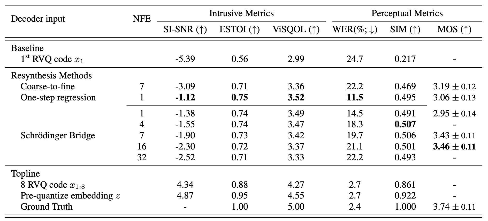

## 
 A Closer Look at Neural Codec Resynthesis:   Bridging the Gap between Codec and Waveform Generation 

 Anonymous submission to Interspeech 2024 
 

### 
 Codec Resynthesis Results 

 see paper for detailed explanation 

### 
 Audio Samples 

 Demo samples are used in the MOS test. 

 !!! Wearing headphones is strongly recommended to judge the audio quality !!! 

|  |  |  |  |  |  |  |  |  |  |  |  |  |  |  |
| :---: | :---: | :---: | :---: | :---: | :---: | :---: | :---: | :---: | :---: | :---: | :---: | :---: | :---: | :---:  |
| Input (1st RVQ code) | <audio src="samples/input/121-127105-0006.wav" controls style="width:200px;" preload></audio> | <audio src="samples/input/8463-294825-0006.wav" controls style="width:200px;" preload></audio> | <audio src="samples/input/1221-135767-0015.wav" controls style="width:200px;" preload></audio> | <audio src="samples/input/8463-294828-0003.wav" controls style="width:200px;" preload></audio> | <audio src="samples/input/3575-170457-0055.wav" controls style="width:200px;" preload></audio> | <audio src="samples/input/2830-3980-0045.wav" controls style="width:200px;" preload></audio> | <audio src="samples/input/4992-23283-0001.wav" controls style="width:200px;" preload></audio> | <audio src="samples/input/3575-170457-0010.wav" controls style="width:200px;" preload></audio> | <audio src="samples/input/260-123286-0016.wav" controls style="width:200px;" preload></audio> | <audio src="samples/input/1284-1181-0006.wav" controls style="width:200px;" preload></audio> | <audio src="samples/input/4970-29093-0004.wav" controls style="width:200px;" preload></audio> | <audio src="samples/input/260-123286-0005.wav" controls style="width:200px;" preload></audio> | <audio src="samples/input/5105-28233-0005.wav" controls style="width:200px;" preload></audio> | <audio src="samples/input/4992-41806-0017.wav" controls style="width:200px;" preload></audio> | <audio src="samples/input/7127-75946-0008.wav" controls style="width:200px;" preload></audio> |
| Coarse-to-fine (NFE=7) | <audio src="samples/coarse2fine/121-127105-0006.wav" controls style="width:200px;" preload></audio> | <audio src="samples/coarse2fine/8463-294825-0006.wav" controls style="width:200px;" preload></audio> | <audio src="samples/coarse2fine/1221-135767-0015.wav" controls style="width:200px;" preload></audio> | <audio src="samples/coarse2fine/8463-294828-0003.wav" controls style="width:200px;" preload></audio> | <audio src="samples/coarse2fine/3575-170457-0055.wav" controls style="width:200px;" preload></audio> | <audio src="samples/coarse2fine/2830-3980-0045.wav" controls style="width:200px;" preload></audio> | <audio src="samples/coarse2fine/4992-23283-0001.wav" controls style="width:200px;" preload></audio> | <audio src="samples/coarse2fine/3575-170457-0010.wav" controls style="width:200px;" preload></audio> | <audio src="samples/coarse2fine/260-123286-0016.wav" controls style="width:200px;" preload></audio> | <audio src="samples/coarse2fine/1284-1181-0006.wav" controls style="width:200px;" preload></audio> | <audio src="samples/coarse2fine/4970-29093-0004.wav" controls style="width:200px;" preload></audio> | <audio src="samples/coarse2fine/260-123286-0005.wav" controls style="width:200px;" preload></audio> | <audio src="samples/coarse2fine/5105-28233-0005.wav" controls style="width:200px;" preload></audio> | <audio src="samples/coarse2fine/4992-41806-0017.wav" controls style="width:200px;" preload></audio> | <audio src="samples/coarse2fine/7127-75946-0008.wav" controls style="width:200px;" preload></audio> |
| One step (NFE=1) | <audio src="samples/onestep/121-127105-0006.wav" controls style="width:200px;" preload></audio> | <audio src="samples/onestep/8463-294825-0006.wav" controls style="width:200px;" preload></audio> | <audio src="samples/onestep/1221-135767-0015.wav" controls style="width:200px;" preload></audio> | <audio src="samples/onestep/8463-294828-0003.wav" controls style="width:200px;" preload></audio> | <audio src="samples/onestep/3575-170457-0055.wav" controls style="width:200px;" preload></audio> | <audio src="samples/onestep/2830-3980-0045.wav" controls style="width:200px;" preload></audio> | <audio src="samples/onestep/4992-23283-0001.wav" controls style="width:200px;" preload></audio> | <audio src="samples/onestep/3575-170457-0010.wav" controls style="width:200px;" preload></audio> | <audio src="samples/onestep/260-123286-0016.wav" controls style="width:200px;" preload></audio> | <audio src="samples/onestep/1284-1181-0006.wav" controls style="width:200px;" preload></audio> | <audio src="samples/onestep/4970-29093-0004.wav" controls style="width:200px;" preload></audio> | <audio src="samples/onestep/260-123286-0005.wav" controls style="width:200px;" preload></audio> | <audio src="samples/onestep/5105-28233-0005.wav" controls style="width:200px;" preload></audio> | <audio src="samples/onestep/4992-41806-0017.wav" controls style="width:200px;" preload></audio> | <audio src="samples/onestep/7127-75946-0008.wav" controls style="width:200px;" preload></audio> |
| Schrödinger&nbsp;Bridge (NFE=1) | <audio src="samples/sb_nfe1/121-127105-0006.wav" controls style="width:200px;" preload></audio> | <audio src="samples/sb_nfe1/8463-294825-0006.wav" controls style="width:200px;" preload></audio> | <audio src="samples/sb_nfe1/1221-135767-0015.wav" controls style="width:200px;" preload></audio> | <audio src="samples/sb_nfe1/8463-294828-0003.wav" controls style="width:200px;" preload></audio> | <audio src="samples/sb_nfe1/3575-170457-0055.wav" controls style="width:200px;" preload></audio> | <audio src="samples/sb_nfe1/2830-3980-0045.wav" controls style="width:200px;" preload></audio> | <audio src="samples/sb_nfe1/4992-23283-0001.wav" controls style="width:200px;" preload></audio> | <audio src="samples/sb_nfe1/3575-170457-0010.wav" controls style="width:200px;" preload></audio> | <audio src="samples/sb_nfe1/260-123286-0016.wav" controls style="width:200px;" preload></audio> | <audio src="samples/sb_nfe1/1284-1181-0006.wav" controls style="width:200px;" preload></audio> | <audio src="samples/sb_nfe1/4970-29093-0004.wav" controls style="width:200px;" preload></audio> | <audio src="samples/sb_nfe1/260-123286-0005.wav" controls style="width:200px;" preload></audio> | <audio src="samples/sb_nfe1/5105-28233-0005.wav" controls style="width:200px;" preload></audio> | <audio src="samples/sb_nfe1/4992-41806-0017.wav" controls style="width:200px;" preload></audio> | <audio src="samples/sb_nfe1/7127-75946-0008.wav" controls style="width:200px;" preload></audio> |
| Schrödinger&nbsp;Bridge (NFE=7) | <audio src="samples/sb_nfe7/121-127105-0006.wav" controls style="width:200px;" preload></audio> | <audio src="samples/sb_nfe7/8463-294825-0006.wav" controls style="width:200px;" preload></audio> | <audio src="samples/sb_nfe7/1221-135767-0015.wav" controls style="width:200px;" preload></audio> | <audio src="samples/sb_nfe7/8463-294828-0003.wav" controls style="width:200px;" preload></audio> | <audio src="samples/sb_nfe7/3575-170457-0055.wav" controls style="width:200px;" preload></audio> | <audio src="samples/sb_nfe7/2830-3980-0045.wav" controls style="width:200px;" preload></audio> | <audio src="samples/sb_nfe7/4992-23283-0001.wav" controls style="width:200px;" preload></audio> | <audio src="samples/sb_nfe7/3575-170457-0010.wav" controls style="width:200px;" preload></audio> | <audio src="samples/sb_nfe7/260-123286-0016.wav" controls style="width:200px;" preload></audio> | <audio src="samples/sb_nfe7/1284-1181-0006.wav" controls style="width:200px;" preload></audio> | <audio src="samples/sb_nfe7/4970-29093-0004.wav" controls style="width:200px;" preload></audio> | <audio src="samples/sb_nfe7/260-123286-0005.wav" controls style="width:200px;" preload></audio> | <audio src="samples/sb_nfe7/5105-28233-0005.wav" controls style="width:200px;" preload></audio> | <audio src="samples/sb_nfe7/4992-41806-0017.wav" controls style="width:200px;" preload></audio> | <audio src="samples/sb_nfe7/7127-75946-0008.wav" controls style="width:200px;" preload></audio> |
| Schrödinger&nbsp;Bridge (NFE=16)  | <audio src="samples/sb_nfe16/121-127105-0006.wav" controls style="width:200px;" preload></audio> | <audio src="samples/sb_nfe16/8463-294825-0006.wav" controls style="width:200px;" preload></audio> | <audio src="samples/sb_nfe16/1221-135767-0015.wav" controls style="width:200px;" preload></audio> | <audio src="samples/sb_nfe16/8463-294828-0003.wav" controls style="width:200px;" preload></audio> | <audio src="samples/sb_nfe16/3575-170457-0055.wav" controls style="width:200px;" preload></audio> | <audio src="samples/sb_nfe16/2830-3980-0045.wav" controls style="width:200px;" preload></audio> | <audio src="samples/sb_nfe16/4992-23283-0001.wav" controls style="width:200px;" preload></audio> | <audio src="samples/sb_nfe16/3575-170457-0010.wav" controls style="width:200px;" preload></audio> | <audio src="samples/sb_nfe16/260-123286-0016.wav" controls style="width:200px;" preload></audio> | <audio src="samples/sb_nfe16/1284-1181-0006.wav" controls style="width:200px;" preload></audio> | <audio src="samples/sb_nfe16/4970-29093-0004.wav" controls style="width:200px;" preload></audio> | <audio src="samples/sb_nfe16/260-123286-0005.wav" controls style="width:200px;" preload></audio> | <audio src="samples/sb_nfe16/5105-28233-0005.wav" controls style="width:200px;" preload></audio> | <audio src="samples/sb_nfe16/4992-41806-0017.wav" controls style="width:200px;" preload></audio> | <audio src="samples/sb_nfe16/7127-75946-0008.wav" controls style="width:200px;" preload></audio> |
| Reference | <audio src="samples/gt/121-127105-0006.wav" controls style="width:200px;" preload></audio> | <audio src="samples/gt/8463-294825-0006.wav" controls style="width:200px;" preload></audio> | <audio src="samples/gt/1221-135767-0015.wav" controls style="width:200px;" preload></audio> | <audio src="samples/gt/8463-294828-0003.wav" controls style="width:200px;" preload></audio> | <audio src="samples/gt/3575-170457-0055.wav" controls style="width:200px;" preload></audio> | <audio src="samples/gt/2830-3980-0045.wav" controls style="width:200px;" preload></audio> | <audio src="samples/gt/4992-23283-0001.wav" controls style="width:200px;" preload></audio> | <audio src="samples/gt/3575-170457-0010.wav" controls style="width:200px;" preload></audio> | <audio src="samples/gt/260-123286-0016.wav" controls style="width:200px;" preload></audio> | <audio src="samples/gt/1284-1181-0006.wav" controls style="width:200px;" preload></audio> | <audio src="samples/gt/4970-29093-0004.wav" controls style="width:200px;" preload></audio> | <audio src="samples/gt/260-123286-0005.wav" controls style="width:200px;" preload></audio> | <audio src="samples/gt/5105-28233-0005.wav" controls style="width:200px;" preload></audio> | <audio src="samples/gt/4992-41806-0017.wav" controls style="width:200px;" preload></audio> | <audio src="samples/gt/7127-75946-0008.wav" controls style="width:200px;" preload></audio> |
